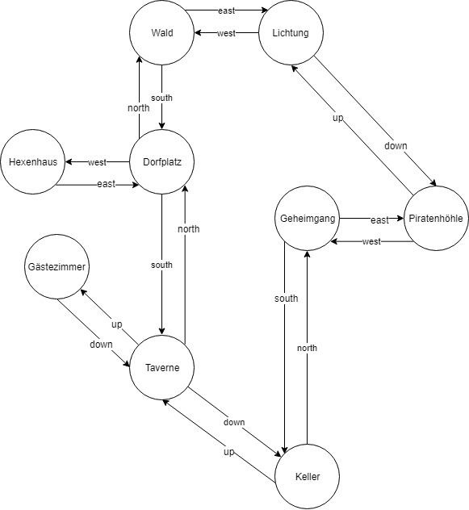

**Die Welt von Zuul**

**Aufgabe 1**

Lade dir das Archiv DieWeltVonZuul.zip von ItsLearning herunter.

*Eclipse*: Importiere das Archiv als Projekt

File à Import à existing Project into Workspace à Archiv auswählen

*Eclipse*: Beachte, dass eventuell die Java-Version angepasst werden muss (Project à Properties à Java Build Path à Libraries à Button „Edit“)

*IntelliJ*: Entpacke das Archiv z.B. auf H:\projekte\zuul, starte IntelliJ und öffne es (File à open).

IntelliJ: Beachte, dass eventuell die Java-Version angepasst werden muss (File à Project Structure à richtiges JDK auswählen)

Starte das Spiel und schaue, welche Interaktionen möglich sind.

**Aufgabe 2**

Betrachte den Source-Code der Anwendung. Was passiert in der Methode spielen() der Klasse Spiel? Versuche zu verstehen, wie der Programmfluss bei der Eingabe von help, go und quit aussieht. Was passiert im Code, wenn man z.B. go north eingibt?

**Aufgabe 3**

Lies die folgenden Kästen durch. Die beiden hier eingeführten Begriffe der Objektorientierten Programmierung werden im weiteren Verlauf häufig benutzt werden:

**Kopplung**

Der Begriff Kopplung beschreibt den Grad der Abhängigkeit zwischen Klassen. Es wird eine möglichst lose Kopplung angestrebt, also ein System, in dem jede Klasse weitgehend unabhängig ist und mit anderen Klassen nur über möglichst schmale, wohl definierte Schnittstellen kommuniziert.

**Kohäsion**

Der Begriff Kohäsion beschreibt, wie gut eine Programmeinheit eine logische Aufgabe oder Einheit abbildet. In einem System mit hoher Kohäsion ist jede Programmeinheit (eine Methode, Klasse oder ein Modul) verantwortlich für genau eine wohl definierte Aufgabe oder Einheit. Ein guter Klassenentwurf weist einen hohen Grad an Kohäsion auf.

- Eine Programmeinheit sollte für eine in sich geschlossene Aufgabe zuständig sein.
- Eine Methode sollte **eine** logische Operation implementieren.
- Eine Klasse sollte genau **einen** Typ von Objekt modellieren.
- Hauptanlass für Kohäsion ist die Wiederverwendung: Sie erhöht die Wahrscheinlichkeit, dass eine Klasse oder Methode in einem anderen Zusammenhang eingesetzt werden kann. Außerdem gibt es den Vorteil, dass im Falle von Änderungen die Stellen, die von diesen Änderungen betroffen sind, eher in einer Einheit zu finden sind.

Verstößt man gegen das **DRY-Prinzip** (Don’t repeat yourself), liegt häufig eine schlechte Kohäsion vor. Ein Beispiel wäre Code-Duplizierung:

- Erscheint ein Quelltextabschnitt mehr als einmal in einer Anwendung, spricht man von Code-Duplizierung
- Codeduplizierung birgt die Gefahr von Fehlern und Inkonsistenzen.
- Codeduplizierung ist ein Zeichen für schlechte Kohäsion.

**Aufgabe 4**

Schaue dir die Methoden wechselRaum() und willkommensTextAusgeben() an. Dort gibt es z.B. die oben beschriebene (fiese) Code-Duplizierung!

Schreibe eine Methode raumInfoAusgeben(), die du in den Methoden wechsleRaum() und willkommenstextAusgeben() aufgerufen wird und darüber die Codeduplizierung und die schlechte Kohäsion auflöst.

**Aufgabe 5**

Erweiterung des Spiels: Es sollen die Bewegungsrichtungen up und down hinzugefügt werden. Dementsprechend brauchen wir ein paar neue Räume. Die Taverne hat nun einen ersten Stock, in dem die Gästezimmer untergebracht sind. Außerdem hat die Taverne einen Keller, von dem ein Geheimgang zu einer alten Piratenhöhle unter der Lichtung führt. Der auf der nachfolgenden Seite abgebildete Graph verdeutlicht, welche Wege möglich sein sollen.

Dazu sind Änderungen an folgenden Stellen nötig:

- In der Klasse Raum
    - neue Instanzvariablen anlegen (treppeNachOben, treppeNachUnten)
    - in der Methode setzeAusgänge()
- In der Klasse Spiel in der Methode
    - raeumeAnlegen()
    - rauminfoAusgeben()
    - wechsleRaum()

Teste dein Programm!

